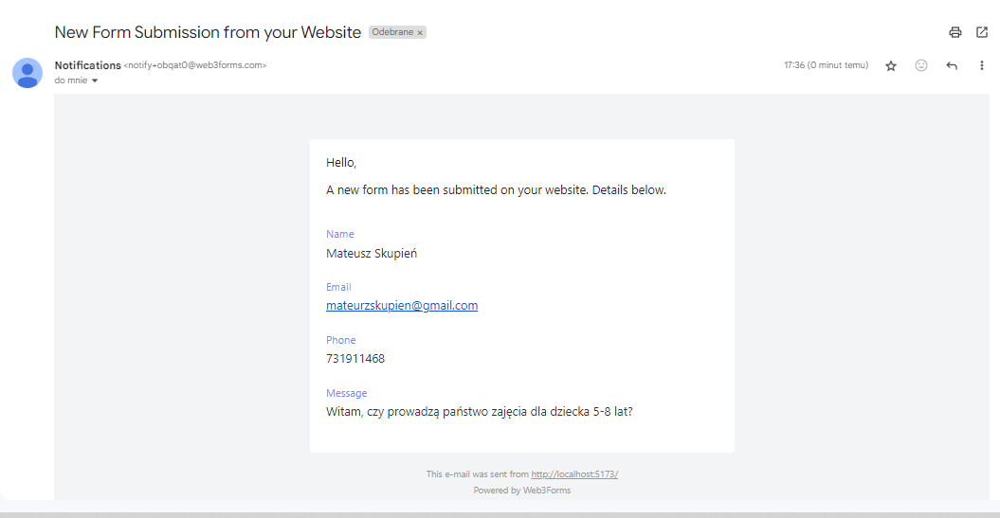

# 📘 Tutoring & Group Classes Platform 🌟

**An educational platform** designed for kids and adults, offering personalized tutoring sessions and engaging group classes to support learning in a fun and effective way.


## 🚀 Features

- **Personalized Tutoring:** One-on-one sessions tailored to individual needs.
- **Group Classes:** Collaborative learning opportunities for various age groups.
- **Responsive Design:** Accessible across devices for seamless learning anytime, anywhere.
- **Modern Interface:** Intuitive and user-friendly design for both students and tutors.
- **External API Integration:** The platform includes an external API that enables email-based inquiries to be received and sent effectively.



---

## 🛠️ Tech Stack

- **Frontend:** React, Vite
- **Styling:** CSS for modern, clean design
- **Build Tools:** Vite for fast development and optimized builds

---

## 🏗️ Setup Instructions

1. Clone the repository:

   ```bash
   git clone https://github.com/your-username/your-project.git
   cd your-project

2. Install dependencies:

    ```bash
    npm install
    # or
    yarn install

3. Start the development server:

    ```bash
    npm run dev
    # or
    yarn dev

4. Open yourn browser and visit:

    ```bash
    http://localhost:5173

---

## 🔧 Scripts

- **`npm run dev`** – Start the development server.
- **`npm run build`** – Create an optimized production build.
- **`npm run preview`** – Preview the production build locally.

---

## 🤝 Contributing

We welcome contributions! To get started:

1. Fork the repository.
2. Create a new feature branch:

    ```bash
    git checkout -b feature-name

3. Commit your changes and push:
    ```bash
    git push origin feature-name

4. Open a pull request.

---

## 📄 License

This project is licensed under the [MIT License](LICENSE).
